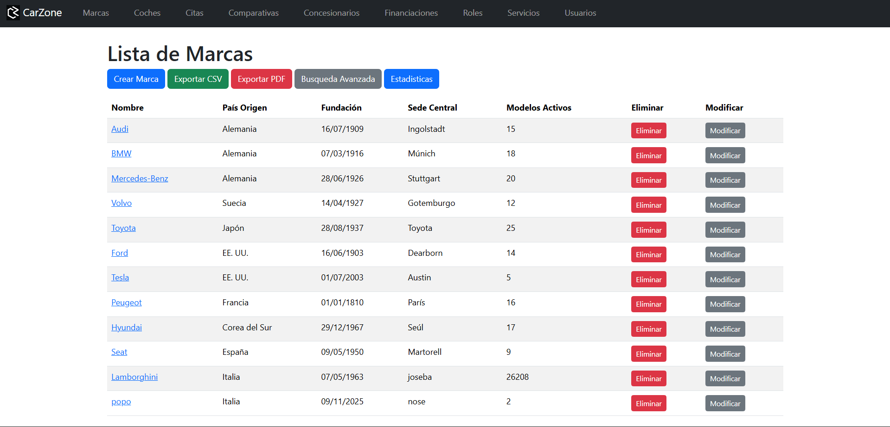
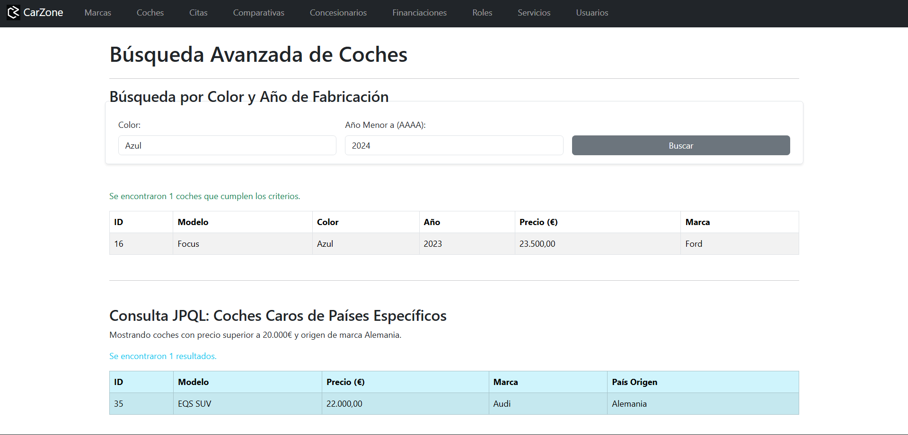
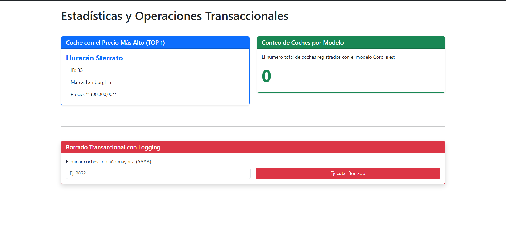

# 🚗 Proyecto CarZone: Gestión de Concesionario y Taller

## 📝 Descripción del Proyecto y Temática Elegida

El proyecto **CarZone** es una aplicación web y una API REST desarrollada con **Spring Boot** y **Spring Data JPA** que simula un sistema integral de gestión para un concesionario y taller de vehículos.

La aplicación permite la administración completa de las entidades principales:

1.  **Marcas:** Gestión de fabricantes (CRUD, búsquedas avanzadas y estadísticas).
2.  **Coches:** Gestión de vehículos (CRUD, asociación a marcas, búsquedas avanzadas y operaciones transaccionales).

**Tecnologías Clave:**
* **Backend:** Java 17+, Spring Boot 3+, Spring Data JPA.
* **Base de Datos:** H2 (para desarrollo) o MySQL.
* **Frontend Web:** Thymeleaf y Bootstrap 5.

---

## 🏗️ Diagrama Entidad-Relación (ER)

El diagrama ER refleja la estructura de la base de datos con la relación fundamental entre `Marca` y `Coche`.

**Relaciones Clave:**

* **`Marca`** tiene una relación **Uno a Muchos (1:N)** con **`Coche`**.
* **`Coche`** tiene una relación **Muchos a Uno (N:1)** con **`Marca`**.

---

## 🛠️ Instrucciones de Instalación y Ejecución

Sigue estos pasos para poner en marcha la aplicación en tu entorno local.

### 1. Requisitos Previos

* **Java 17** o superior.
* **Maven**.

### 2. Ejecución

1.  **Clonar/Descargar el Proyecto.**
2.  **Compilar (Opcional):** Abrir la terminal en la raíz del proyecto y ejecutar: `mvn clean install`
3.  **Ejecutar la Aplicación:** Ejecutar la clase principal de Spring Boot (ej: `[TuClasePrincipalApplication.java]`) o usar el comando: `mvn spring-boot:run`

### 3. Acceso

* **Aplicación Web (Protegida):** `http://localhost:8080/`
* **API REST (Ejemplo):** `http://localhost:8080/api/marcas`

---

## ✅ Listado de Funcionalidades Implementadas

El proyecto cumple con los siguientes requisitos funcionales y técnicos:

### A. Funcionalidades CRUD y Web

| Entidad | CREATE | READ (Listado) | UPDATE | DELETE |
| :--- | :--- | :--- | :--- | :--- |
| **`Marca`** | ✅ | ✅ | ✅ | ✅ |
| **`Coche`** | ✅ | ✅ | ✅ | ✅ |
| **Asociación** | ✅ Relación `Coche` a `Marca` gestionada en formularios. |

### B. Funcionalidades Avanzadas de Repositorios

* **Búsqueda Avanzada (Web):** Vistas con formularios que usan métodos personalizados de `JpaRepository` (ej: buscar `Marca` por nombre y país, `Coche` por color y año).
* **Estadísticas (Web):** Páginas de resumen que utilizan consultas de **agregación** (ej: `countBy...`, `findTop1ByOrderBy...`) y consultas **JPQL con `JOIN`**.
* **Operaciones Transaccionales:** Implementación de borrado masivo transaccional (`@Transactional`) con *logging* explícito para `Coche` (ej: `deleteByAnioGreaterThan`).

### C. API REST

* **Endpoints CRUD:** API REST completa para **`Marca`** y **`Coche`** (GET, POST, PUT, DELETE).
* **Búsqueda Personalizada REST:** Exposición de los métodos avanzados del `MarcaRepository` y `CocheRepository` a través de endpoints RESTful.

---

## 🖼️ Capturas de Pantalla de Vistas Principales

### 1. Lista de Marcas (Web)

  

### 2. Búsqueda Avanzada de Coches

  

### 3. Estadísticas de Coches

  

